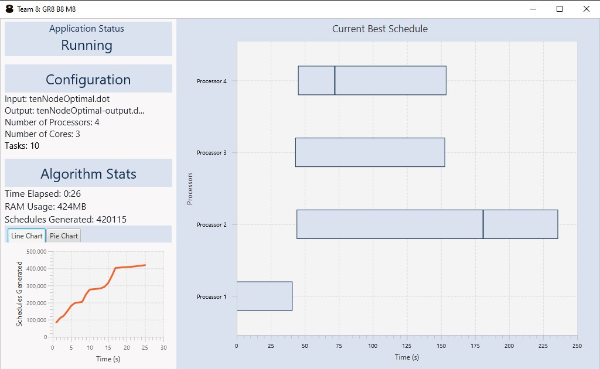
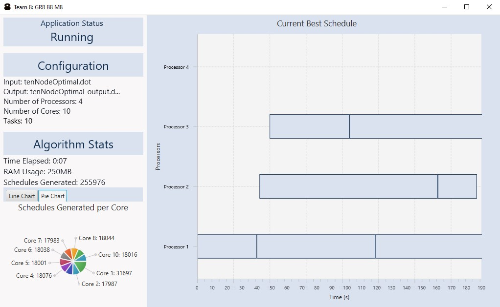

# SOFTENG306 Project-1 Team 8: GR8-B8-M8

This project utilises artificial intelligence(AI) and parallel processing to optimally schedule a set of tasks from a 
directed task graph onto a given amount of processors. This project uses the AStar algorithm to find an optimal 
schedule to the scheduling problem.




## Team 8 - GR8 B8 M8
|Name           |GitHub Username                                            |UPI    |
|---------------|-----------------------------------------------------------|-------|
|David Xiao     |[David-Xia0](https://github.com/David-Xia0)                |dxia063|
|Jennifer Lowe  |[parfei](https://github.com/parfei)                        |jlow987|
|Justin Teo     |[jteo97](https://github.com/jteo97)                        |jteo158|
|Raymond Chiu   |[raymondhonsumchiu](https://github.com/raymondhonsumchiu)  |rchi385|
|Tianren Shen   |[Tianrens](https://github.com/Tianrens)                    |tshe695|


## Importing the project
1. Clone this repository
    ```
    git clone https://github.com/SoftEng306-2020/project-1-8-gr8-b8-m8.git
    ```
2. Import this project as a Gradle Project

## Building the JAR
Run the Gradle Task
```
./gradlew jar
```
The JAR will be generated in the `build/libs` directory.

NOTE: If you do not have sufficient permissions, run the following command.
```
chmod 777 ./gradlew
```

## Running the JAR
1. To run the JAR. Open a new terminal window and `cd` to the directory with the JAR.
2. Type the following command into the terminal window.
    ```
    java -jar scheduler.jar INPUT.dot P [OPTION]
    ```
    
    ```
    INPUT.dot    a task graph with integer weights in dot format
    P            number of processors to schedule the INPUT graph on
    Optional:
    -p N         use N cores for execution in parallel(default is sequential)
    -v           visualise the search
    -o OUTPUT    output file is named OUTPUT(default is INPUT-output.dot)
    ```
    

## Documentation
* [Wiki](wiki/Home.md) 
 
## External Dependencies
* [Apache Commons CLI](https://commons.apache.org/proper/commons-cli/)
* [Paypal Digraph Parser](https://github.com/paypal/digraph-parser)


