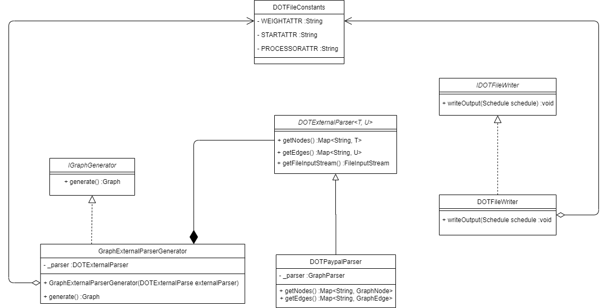
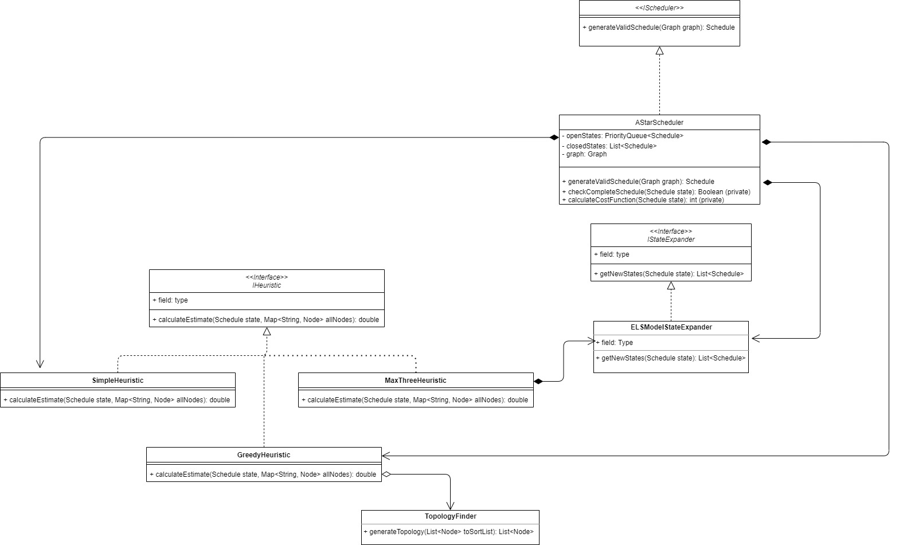

# Implementation Plan

## Class Diagram for Input Parser
_DOT files that have the graph inputs and the outputs: https://en.wikipedia.org/wiki/DOT_(graph_description_language)_

## Class Diagram for milestone 2

## Initial Classes

[MAIN] Class -- Tianren
Handle options and command line inputs → use enum
Fields
Graph = GraphGenerator.getGraph(path)
Modes[] of Enum

[ENUM]
Visualisation, Parallelisation (program modes)

[SERVICE] IOService -- Jennifer
Fields
Input file path
Output file path
 Methods
Convert dot file into string that graph generator can read

[SERVICE] GraphGenerator -- David
Methods
getGraph(String filePath) : Graph
Calls I/O service to obtain file which will be converted

[MODEL] Graph
Fields
Hashmap<String id, Node node> of all nodes
Hashmap<String id, Edge edge> for all edges
Methods
addNode(Node node)
getNode(String nodeID)
addEdge(Edge edge)
getEdge(String ID)

[MODEL] Node -- Justin
Constructor

Fields
Hashmap (Destinations (Node), remote weights) - these are the edges, edge weight
Set (Parents (Node))
Cost
id?

Methods
Add destination(edge)
Add parent
Get id
Set id

[MODEL] Edges :)
Constructor?
Fields
Src node
Dest node
Cost
ID???

[INTERFACE] Scheduler
Methods
Schedule : GenerateValidSchedule(Graph graph)

[SERVICE implements interface] SimpleScheduler
Schedule on top of the specified number of processors
Loop through processes and put the next task in the topology in the earliest available time slot

[MODEL] Schedule
List<Processor> processors
List<Task> unassigned
List<Task> assigned

[MODEL] Processor
List<Task>
Int firstAvaliableTime;

[MODEL] Task
Wrapper for node object
Time scheduled in the schedule?!?!?!?!!?
Processor processor

[SERVICE] TopologyFinder
List<Node> Topology
Get graph and then find random topology

[SERVICE implements interface] OptimalScheduleGenerator - milestone 2 stuff

