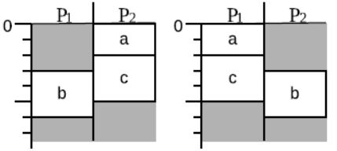
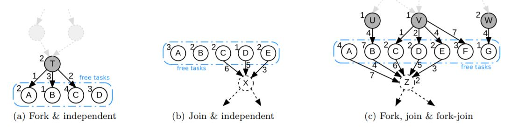

# Pruning
_Due to the large memory consumption of A*, pruning was necessary to reduce the chances of heap overflow._

## 1. Duplication Detection
Depending on the order at which tasks are added onto a partial schedule, duplicate schedules can be
formed during the expansion step.

To prevent the addition of duplicate schedules into the OPEN list, we implemented the OPEN queue where these schedules are to be stored as a Tree Set.
The nature of Java Sets don't allow duplicate objects from being stored.

## 2. Processor Normalisation
All processors are essentially identical and exchangeable if their tasks are the same. This means that any partial schedule is the same as another if
swapping the processor names allows them to match. e.g. In the below example, both partial schedules are the same, only their processors are switched around.

In order to prune these duplicate/identical partial schedules, we override the TreeSet's add() and create a SchedulerComparator.
By overriding/implementing, we can perform checks on a schedule before we add them to OPEN and CLOSED.

## 3. Identical Tasks
Tasks are considered identical when the following conditions are met:
- Same task costs
- Same parent tasks
- Same children tasks
- Same incoming remote/edge costs
- Same outgoing remote/edge costs

When creating the graph model, all the tasks are scanned over to check if they are identical to any other tasks. When a tasks was found to match all five conditions
with others, they are all grouped/chained together. This helps with pruning as the A* algorithm will consider all possible permutations of the graph despite their being identical 
nodes. By chaining these tasks together, we reduce these permutation options, hence reducing the search space.

## 4. Heuristic Schedules
Partial schedules that form large heuristic costs are very unlikely to branch in the optimal direction. To prune these unnecessary partial schedules
a heuristic ([Pruning Heuristics](heuristics.md)) is used on the initial, empty schedule. This provides us with an upper bound estimate. Any partial schedules found to 
have a higher heuristic cost will be abandoned, thus reducing the amount of memory needed to store them otherwise.

## 5. Fixed Task Ordering
Fork, Join and Fork/Join graphs are extreme cases which expose the maximum amount of concurrency. To handle these special graphs we implement a fixed ordering to reduce the number of permutations
created during the algorithm's runtime.

For all free tasks, verify that they each: 
- have at most one parent and at most one child
- if the task has  a child, then all  other free tasks have the same child
- if the task has a parent, then all the other parents of the free tasks are also allocated to the same processor as it.

THEN: you can fix order by:
- sort the free tasks by increasing DRT. basically it's just the finish time of the parent + weight of the edge that connects to the parent. Without a parent node, this time is set to zero.
- then you break ties by sorting according to decreasing out-edge costs. no out-edge: set cost to zero
- verify that all these free tasks are in decreasing out-edge cost order