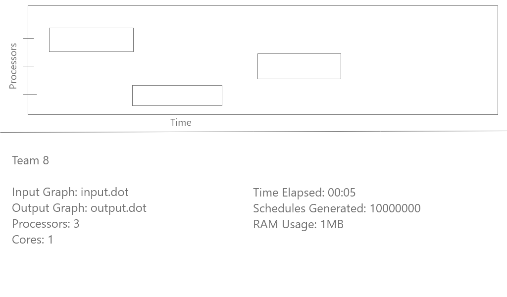
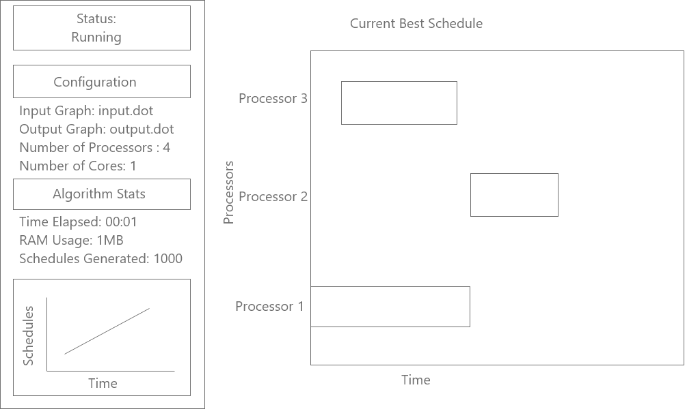

# Visualisation
What to display?
##### User command line input
* Input File Name
* Output File Name
* Number of Processors
* Number of Cores

##### Meaningful and Live components
* Time elapsed
* Schedules generated
* RAM Usage
* Number of schedules generated over time - Line Graph
* Current best schedule generated - Gantt Graph
* Application Status - NOT-RUNNING, RUNNING, DONE, ERROR

##### Parallelisation
* Schedules generated by each thread/core - Pie Chart

## Lo-Fi Wireframes
#### Option 1: 
#####2 Row layout.

* May not be able to fit Gnatt Chart if there are 10 processors.
* Will need to column in bottom half.
#### Option 2:
##### 2 Column layout

* Chosen design.
* Swap line graph with a tab pane, allowing the user to switch between line chart and pie chart.

## Colour Scheme
### Light Theme
* White
* Blue
* Light blue

### Dark Theme
* Black
* Dark grey
* Blue
* White

Light theme was chosen.

## Font
* Roboto?

## Libraries / Tools
* JavaFx
* SceneBuilder
