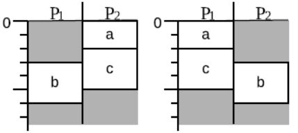
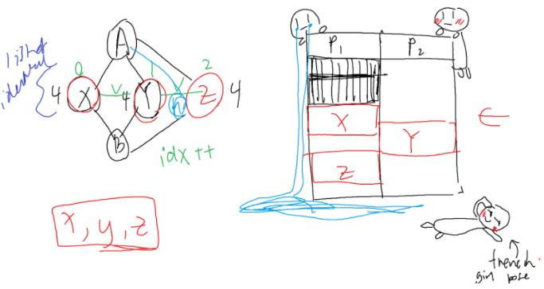

## Meeting 15
24/08/2020 9:00pm

#### AGENDA
- Oliver - talk about his points, email
- Pruning techniques
- Talk about what Oliver said
- Email Oliver about
    - Weight attribute
    - Multiple GUI threads
- Pruning techniques
    - Processor normalisation (at every expansion) 
        - Set<Sets> in schedule
            - The outer set represents the schedule, and inside it, for each processor there is a set which contains tasks.
                - Start time to check if they are actually identical
            - This is when we are crafting up the schedule
            - For the first node, we are just chucking it in. Could we also check if all processor finishing time is the same, then???? But parents.
            - We might have to override sets because of identical nodes
            

- Identical Tasks
    - Node class
- List of identical nodes - goes both ways(in both objects)
    - Some grouping mechanism between the identical tasks. All we need is something to identify when we try to schedule in a node that is part of a identical node group. Then we only select one of them.
    - When we’re constructing the graph, we find these identical nodes. Put them into a list, and there is an index for choosing them. “Preserve their ordering”. ++ whenever a node is chosen.
    - zero cost edges between them? But might muck up the output graph
    - Virtual edge data structure?
    - ONE IDEA
        - While we are constructing the nodes, check if there are identical nodes. Put into a list
        - When we are scheduling in, check if the list is empty or not. If it is, add the other nodes and then put into a list in the scheduler. This is the “excluded”. The list is reset every time.

- Heuristic schedules - simple or the greedy - prune schedules
    - This would come after you calculate the heuristic
- Before we add the schedules into the open and closed list

_Justin found a way to combine two comparators. Comparator.thencompare_

### Jump ship date: Wednesday

&nbsp;
#### ACTION ITEMS:
- Sets thing about duplicate states, Set<Set>
    - Priority add checker { {}, {} } - this will require extending priority queue and making another class. This class is what encapsulates the priority queue and its functionality - Raymond
        - Override add to check for dupes
        - Will check both open and closed lists
        - Check sets then check start time
- Changes in the schedule class - Justin
    - Use sets<sets<String>> to identify processors with tasks in them. The string being the tasks themselves. You will need to check the start times.
- Changes in ESL state expander - Raymond
    - Schedule onto the sets
- Heuristic schedules - simple or the greedy - prune schedules - Justin
    - Edit Graph class to add a heuristic cost. This is the actual graph’s initial first schedule heuristic upper bound.
        - NEXT MEETING: actually use this
    - This would come after you calculate the heuristic
- Identical tasks - Jennifer
- Priority queue and comparator - Justin
    - Place into AstarScheduler
- Bottom level and put into graph object - David
- Visualisation - Tianren, ask for help if you need it
- Research - Jennifer & David (section 4 and 5)
- Look over the classes that aren’t being worked on for full clean - David
- Check one more time before making PR - David
- Read over the heuristic thing before we merge it - everyone
- Email to Oliver
    - Weight attribute
    - Multiple threads for GUI
    - Windows size
