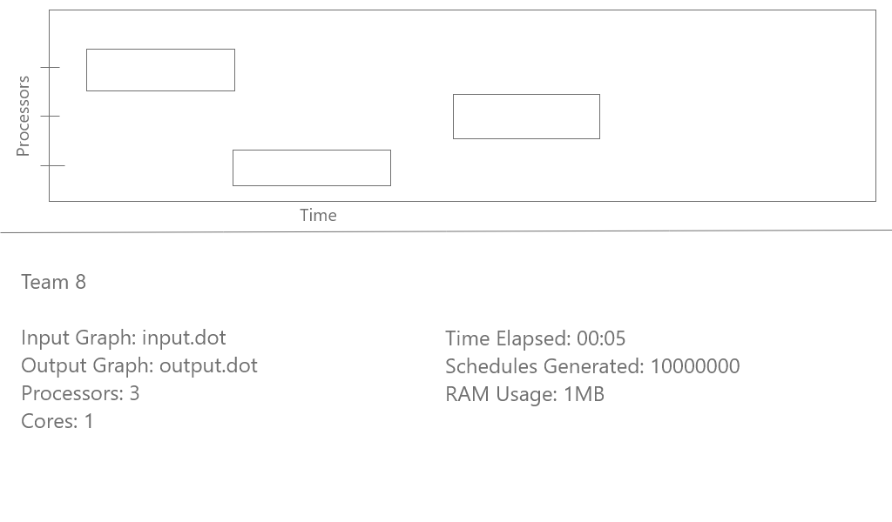

# Visualisation
What to display?
##### User command line input
* Input File Name
* Output File Name
* Number of Processors
* Number of Cores

##### Meaningful and Live components
* Time elapsed
* Schedules generated
* Number of schedules generated over time - Line Graph
* Current best schedule generated - Gantt Graph

##### Parallelisation
* Schedules generated by each thread/core - Pie Chart

## Lo-Fi Wireframes
#### Option 1: 
#####2 Row layout.

#### Option 2:
##### 2 Column layout

